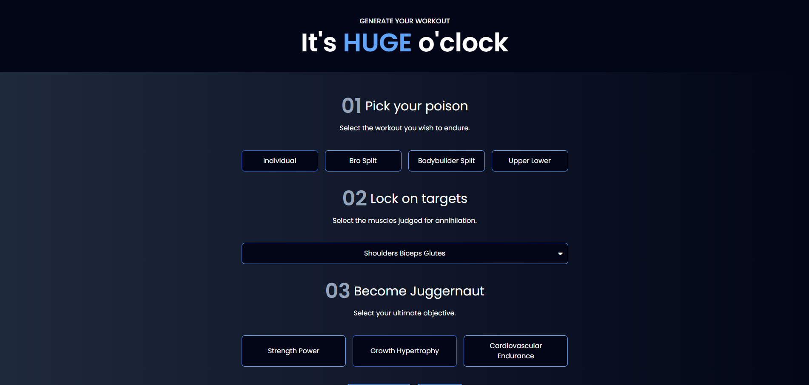

# [Go Gyming](https://go-gyming.netlify.app/)

Welcome to the Go Gyming! This application allows users to select the type of workout they want to do and provides a comprehensive list of exercises to target those muscles. Built with Vite, React, and styled using Tailwind CSS.

## Table of Contents

-   [Features](#features)
-   [Installation](#installation)
-   [Usage](#usage)

## Features

-   Select from various types of workouts.
-   Get a detailed list of exercises for each muscle group.
-   Simple, responsive UI built with Tailwind CSS.
-   Fast and efficient performance with Vite.

## Installation

Follow these steps to get the project up and running on your local machine:

1. **Clone the repository:**

    ```bash
    git clone https://github.com/VivekChaurasia03/Go-Gyming.git
    cd Go-Gyyming
    ```

2. **Install dependencies:**

    ```bash
    npm install
    ```

3. **Install Tailwind CSS:**
   Install Tailwind CSS via npm and create the necessary configuration files.

    ```bash
    npm install -D tailwindcss postcss autoprefixer
    npx tailwindcss init -p
    ```

4. **Configure Tailwind CSS:**
   Update `tailwind.config.js` with the paths to your template files:

    ```js
    /** @type {import('tailwindcss').Config} */
    export default {
        content: ["./index.html", "./src/**/*.{js,ts,jsx,tsx}"],
        theme: {
            extend: {},
        },
        plugins: [],
    };
    ```

5. **Add Tailwind directives to your CSS:**
   In your `index.css` file (or equivalent), add the Tailwind directives:

    ```css
    @tailwind base;
    @tailwind components;
    @tailwind utilities;
    ```

6. **Run the development server:**

    ```bash
    npm run dev
    ```

    The app should now be running at `http://localhost:5173`.

## Usage

1. **Select Workout Type:**

    - Choose from various workout types available on the homepage.

2. **View Exercises:**

    - After selecting a workout type, view a comprehensive list of exercises targeting the specific muscles.

3. **Responsive Design:**
    - The web app is fully responsive and works on various devices, from desktops to smartphones.


